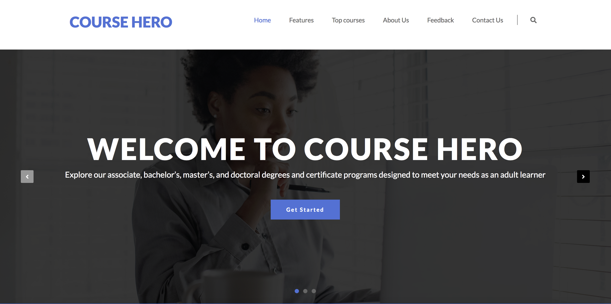
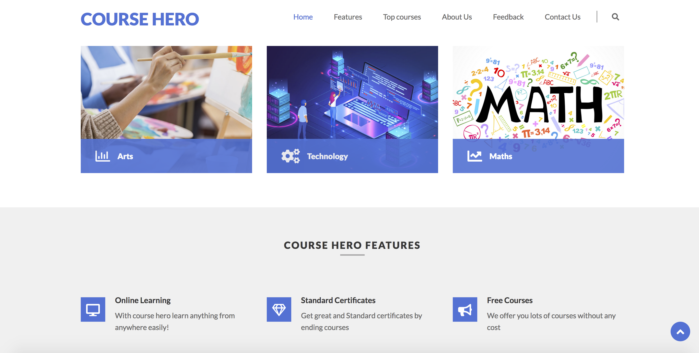

# Girls_in_STEM
Group Project of girlsinSTEM event

# Course Hero
> Static design of an online platform for learning (E-learning website)
> Live demo [_here_](https://shahira-sadat.github.io/Girls_in_STEM/).

## Table of Contents
* [General Info](#general-information)
* [Technologies Used](#technologies-used)
* [Screenshots](#screenshots)
* [Acknowledgements](#acknowledgements)

## General Information
- Course Hero is static design of e-leaning website which is created in GirlsinSTEM event.
- E-learning platform easily solves educational problems specialy in existing pandemic.
- Course Hero is a group project in grils in STEM event.

## Technologies Used
- HTML
- CSS
- Bootstrap
- Javascript

## Screenshots

## Demo
Check demo here [Project Demo]( https://shahira-sadat.github.io/Girls_in_STEM)

## Acknowledgements
- This project was inspired by a template
- This project is based on a template from [This website](https://wpfreecloud.com/)
-Thanks to wpfreecloud

## Contact
Created by [@CourseHero Team](coursehero@gmail.com) - feel free to contact me!
